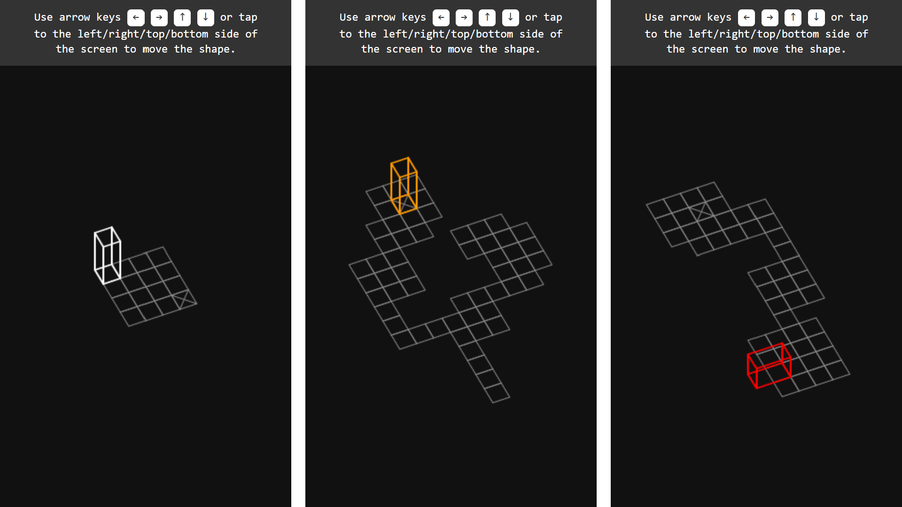

# Vectrex game Bloxorz

A JavaScript implementation of Bloxorz game for a vector display-based home video game console [Vectrex](https://en.wikipedia.org/wiki/Vectrex). View demo here: [codepen.io](https://codepen.io/mnbond/pen/XJrZNjq).



## Instructions

1. Add JavaScript code containing class `Vectrex` in an HTML document:
  ````html
<script src="js/vectrex.js" type="text/javascript"></script>
  ````
2. Add HTML element for the game in `body` section:
  ```html
<div id="vectrex-container"></div>
  ```
3. Сreate an instance of class `Vectrex` after the `DOMContentLoaded` event:
  ```js
let vectrex = null;

document.addEventListener("DOMContentLoaded", () => {
    const cellSizePx = 30;
    const containerId = "vectrex-container";
    vectrex = new Vectrex(containerId, cellSizePx);
});
  ```

Class `Vectrex` constructor parameters:
- `containerId` — ID of HTML element for the game;
- `cellSizePx` — size of cell in pixels, default 10 pixels.

## Adding new levels

To add new levels modify this method of class `Vectrex`:
```js
class Vectrex {
    ...
    setDefaultProperties() {
        ...
        this.settings = {
            ...
            levels: [
                {
                    cells: [],
                    cellStartPosition: [],
                    cellFinishPosition: []
                }
```